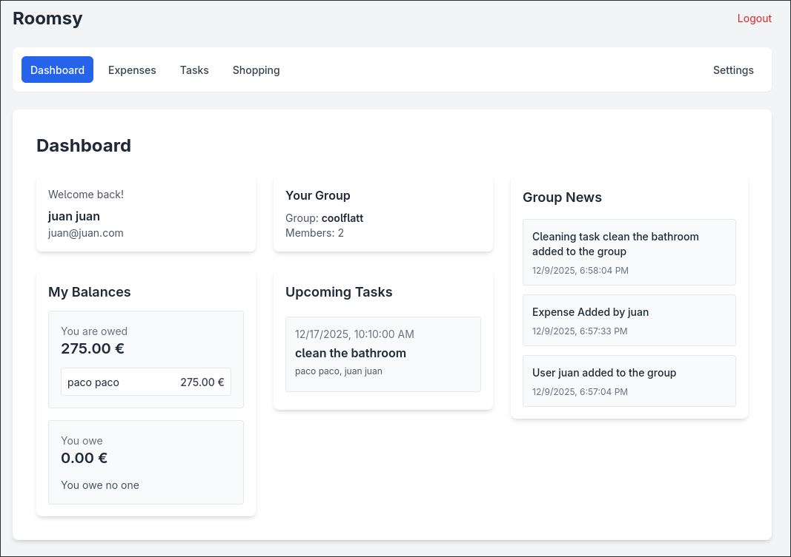
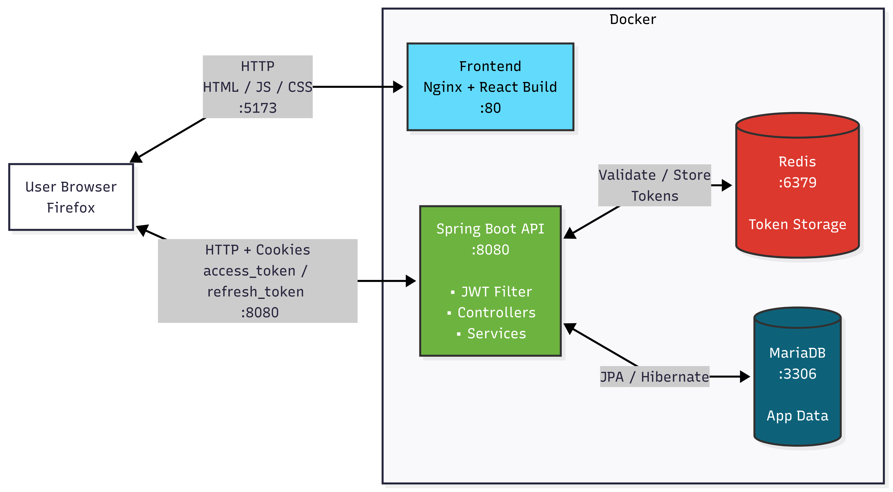
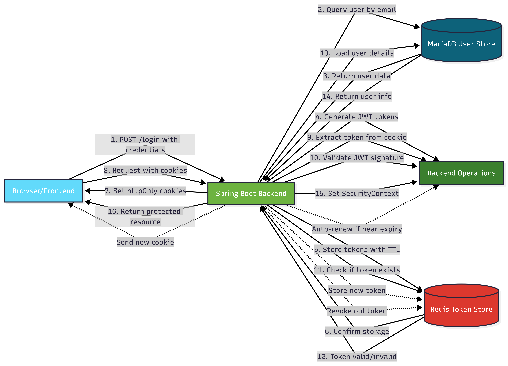

# Roomsy

Roomsy is a web application to manage the chores, the shopping list and the shared expenses for your household.  




## Overview

- Backend: Java + Spring Boot
    - JWT-based authentication & session management with short-lived access tokens and refresh tokens (cookies + server-side token revocation)
    - USER / ADMIN roles to restrict endpoints
    - JSON View annotations to control serialization per endpoint
    - JSON Patch (RFC 6902) support for fine-grained updates
    - OpenAPI/Swagger documentation auto-generate
    - Pageable endpoints for list retrievals (supports page, size, sortBy, sortDirection parameters)

- Frontend: React + Tailwind CSS, component-based UI that consumes backend API via a small client wrapper.

## Architecture & Project Structure

 

- Backend
  - Controllers: REST endpoints that validate requests and call services.
  - Services: Business logic and transactions.
  - Repositories: Spring Data JPA repositories 
  - Models / DTOs: JPA entities and DTOs 
  - Exceptions: Centralized exception handling ([`GlobalHandlerException.java`](backend/src/main/java/com/roomsy/backend/exception/GlobalHandlerException.java)) with custom exception types and consistent error responses.
  - Security: JWT tokens (access + refresh) are issued by [`JwtUtil`](backend/src/main/java/com/roomsy/backend/security/JwtUtil.java), stored/validated via [`TokenService`](backend/src/main/java/com/roomsy/backend/security/TokenService.java), and sent to clients as cookies managed by [`CookieUtil`](backend/src/main/java/com/roomsy/backend/security/CookieUtil.java). Authentication filter: [`JwtAuthenticationFilter`](backend/src/main/java/com/roomsy/backend/security/JwtAuthenticationFilter.java)

- Frontend
  - React app (component hierarchy)
  - Central auth context
  - API client and token-expiration handling

- Data storage
  - Primary relational DB: MariaDB (configured in repository and docker-compose)
  - Secondary ephemeral store: Redis (used to store and revoke tokens)

- Docker compose config

### Authentication Flow Diagram

 

## Main Features

- Login / Register using mail and password
- Create or join a group with an invite code
- Manage your group 
    - Leave the group 
    - Kick someone out 
    - Change the group name  
    - Delete it
- Manage the group expenses
    - Introduce a shared expense between group members and let the app minimize the transactions
    - Pay the expenses you owe or that they owe you
- Manage the group tasks
    - Introduce the tasks you have to do and asign them to the involved members
    - Check all the completed and pending tasks of the group
- Manage the group shopping list and divide the items in categories
- Delete your account and all the information related to it

## Deployment

To run this app locally just follow this steps:
1. Build the app (backend + frontend)
   - Using Docker Compose:
     - File: [docker-compose.yml](docker-compose.yml)
     - Command:
       ```sh
       docker compose build
       ```

2. Run the app
   - Using Docker Compose:
     - File: [docker-compose.yml](docker-compose.yml)
     - Command:
       ```sh
       docker compose up
       ```

## License

This project is licensed under the Apache License, Version 2.0.  
See the [LICENSE](LICENSE) file for details.
